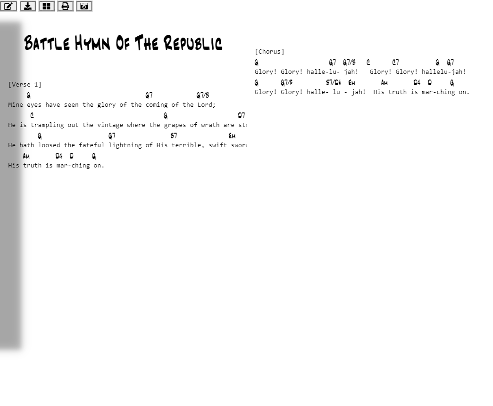

# Fakebooker
###### a tool for beautifying, and viewing leadsheet and tablatures for printing, online, and offline use.
### Turns this:

>Battle Hymn Of The Republic
>
>[Verse 1]
>     G                               G7            G7/B
>Mine eyes have seen the glory of the coming of the Lord;
>      C                                   G                   D7
>He is trampling out the vintage where the grapes of wrath are stored;
>        G                  G7               B7              Em
>He hath loosed the fateful lightning of His terrible, swift sword; 
>    Am       D4  D     G
>His truth is mar-ching on.
>
>
>[Chorus]
>G                   G7  G7/B   C      C7          G  G7
>Glory! Glory! halle-lu- jah!   Glory! Glory! hallelu-jah!
>G      G7/F         B7/D#  Em       Am       D4  D     G
>Glory! Glory! halle- lu - jah!  His truth is mar-ching on.

### Into this:

# Features
* Beautification
  * Chords presented in familiar Jazz Fakebook style font.
  * Tablatures lines shown as full dashes to facsimilate Guitar Magazine tablatures.
  * Sections split between pages so that each stays complete for easy viewing.
* Upload via drag and drop file.
* Quick and easy page turning through touch, mouse, and keyboard controls
* Download html view for offline use.
* Download edited source.
* Print Beautified version.

# Intended uses
* Jazz standard lead sheets.
* Church and community groups.
* Musical education materials for institutions and individuals.
* Originally written compositions.
* Self Education.
  
# Current State:
Beta v0.2

# Rules for lead sheet:
* First line is Title - Artist
* All sections divided into 'blocks' delimited by empty lines

# Planned Features
* Upbload via copy paste.
* Font customization
* Multi song support
* Table of Contents navigation
* Song book saving
* Songbook only Export.
* Midi accompanyment?

# Project Mission and Game B
* Goals
  * To formalize .crd and .tab file formats to create a type of markdown file viewing specifically for music.
  * To drain companies like UG.com of capital until it it forced to stop capitalizing on a corpus of materials that were generated by unpaid contrubutors predating their existance.
  * To give perfectly legal and non-copywrite infringing tools to schools, churches, solo educators, community arts groups, and most importantly the self taught, that allow them to grow was musicians as wall as facilitate contributing back to the musical arts community as a whole.
* History:
  * OLGA
  * Harry Fucks(Fox) debacle
  * The abombination called "Ultimate" Guitar
    * It's pretty much "Needful Things" from R&M
    * This is an attempt to be it's "Curse Purge Plus"
    * UG takes something that was originally a noble and non commercial community effort to help facilliate music education for people who don't have Lana Del Ray's parents, and turned it into a shameless ads grab from a large group of people that have little to nothing. 
    >"HEY! Are you SURE you don't want to use our over bloated "Pro" view?! CAN WE SHOW YOU A LESSONG on a trial basis?! BUY OUR SHIT! GIVE US ALL YOUR MONEY! ALL YOUR FUCKING MONEY!!
  * Personal:
    * Asccap(Asshats)
      * Bob's
      * Top of the Roc's